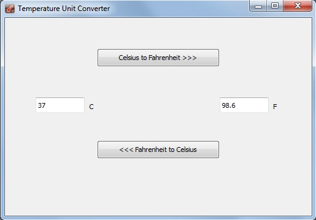
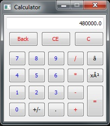

# Python GUI 
Python simple GUI Apps using PyQt4

  
  
 
 
 
 
## Installation:

PyQt4 (Python2 x64):
https://sourceforge.net/projects/pyqt/files/PyQt4/PyQt-4.10/PyQt4-4.10-gpl-Py2.7-Qt4.8.4-x64.exe/download
